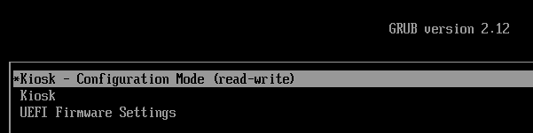

---
hide:
  - navigation
---

# Configuring & locking down a deployed KioskMaker

KioskMaker has two modes:

- **Configuration Mode** - initially, KioskMaker is not locked down. You will boot to a standard (Gnome Linux) desktop, in which you can edit the network configuration and management URL.  
	  
	!!! note ""
	
		If you are reading this page within a newly configured kiosk, you are in Configuration Mode!
	

- **Kiosk Mode** - fully locked down to only load the management URL in a browser. The operating system is read-only and nothing can be changed.

In Configuration Mode you might like to:

1. configure the management URL
2. configure networking
3. configure power saving settings and screen lock
4. set the timezone

## 1) Configure the management URL

Once read-only, the kiosk will load the URL from the `url.txt` file in the home directory. Press alt-tab to switch to the text editor, which should have pre-loaded. The editor can also be seen by pressing the Super (Windows) key, or by clicking the 'Activities' button:

Change the URL, which will initially be pointing to this documentation at `file:///var/www/kiosk/docs/config.html`. For instance, assuming there is a management interface at `https://192.168.1.2`:

Save the `url.txt` file and close the text editor.

!!! note "https certificate?"

    if your URL is https, self-signed, or signed with a CA, place the CA `.pem` file in `copied-to-kiosk/opt/kiosk/template/etc/pki/ca-trust/source/anchors/`\
    then rerun `./02_kioskify-vm`.

To test that the URL appears, close this window (which is the Chrome browser), press the Super key again and search for **chrome kiosk**:

When run, this should re-launch the Chrome browser in 'kiosk' mode, pointing to the URL from `url.txt`. 
## 2) Configure Networking

Click in the top right to see the network settings (here "Wired Connected" -> "Wired Settings"):

In the **Wired** section, you should see one ethernet connection for each ethernet port. If you are using static IPs, configure *all* of the ethernet devices with an IP address, for example `192.168.1.3` if your management server has IP `192.168.1.2`:

All ethernet devices should be configured, so that any ethernet port can be used interchangeably. The gateway does not matter.

Close the network settings page.
## 3) Configure 

Once done, reboot, and in the grub menu (press 'Esc' on boot to ensure it appears) select 'Kiosk':

The kiosk will then boot in read-only mode with just the web browser 
## Reboot and lock in changes

When you are happy that network settings and URL are correct for this kiosk installation, you can 'lock down' the kiosk. This puts it in read-only mode, in which no further changes are possible.

Reboot the kiosk from the menu, and as it reboots you should see the GRUB menu:

Change from **KioskMaker - Configuration Mode (read-write)** to **KioskMaker**. and proceed with the boot.

You will see the kiosk spontaneously reboot once. After booting the second time you will be in locked-down kiosk mode, hopefully with the management URL visible in the browser. The grub menu will not appear on subsequent reboots unless you hold down shift.

<figure class="video_container">
  <video controls="true" allowfullscreen="true">
    <source src="img/kioskboot.webm" type="video/webm">
  </video>
</figure>

Congratulations, you have successfully configured your Kiosk! 

# Getting out of Kiosk mode

To change from locked-down kiosk mode back to [configuration mode](config.md)

 - Power cycle the kiosk
 - As the kiosk starts, press Esc.
 - You should see the grub boot screen:

   
   
   Choose 'Kiosk - Configuration Mode (read-write)'

- When prompted for username, enter `root`
- When prompted for a password, enter the password set at kiosk build time. The password is in the `02_kioskify-vm`
    script, and defaults to `kioskmaker`

