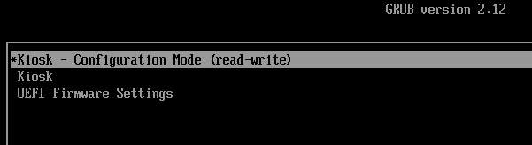
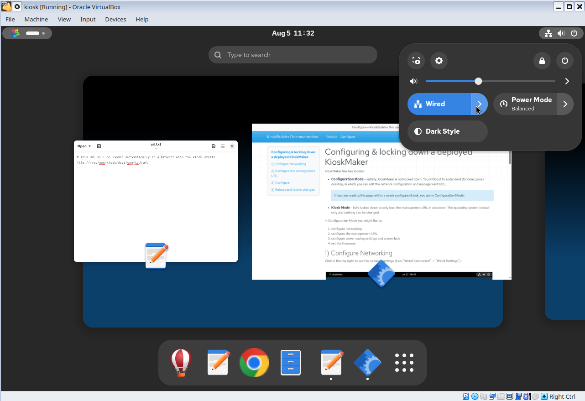

---
hide:
  - navigation
---

# An initially configurable, ultimately locked down Chrome kiosk OS

<figure class="video_container">
  <iframe
    width="560"
    height="315"
    src="https://www.youtube.com/embed/hHzMNW31T1Q"
    title="YouTube video player"
    frameborder="0"
    allow="accelerometer; autoplay; clipboard-write; encrypted-media; gyroscope; picture-in-picture; web-share"
    allowfullscreen>
  </iframe>
  <figcaption>Watch on YouTube: <a href="https://www.youtube.com/watch?v=hHzMNW31T1Q">KioskMaker tour: build your own locked down browser-only operating system</a></figcaption>
</figure>

Say you need a 'kiosk' -- a computer that can only do one thing: run a browser with a particular URL. Our goals are:

 - The computer must boot straight into the browser, with no interaction
 - There must be no other user interface
 - It must not be possible to launch other apps
 - There must be no persistent state. when the 'kiosk' is restarted, it must start completely fresh
 - The kiosk must be robust against casual attempts at interference

## Configurable at deployment

Despite being ultimately locked down and read-only, there must be a some configuration possible at deployment time. The person deploying the kiosk needs to configure the network connection (e.g. with a wifi password), display, and perhaps the URL.

So out the box, a kiosk will boot in 'Configuration Mode':

This launches a standard Gnome interface, in which the kiosk deployer may customize the  kiosk URL, network settings, screensaver, display and anything else:

After configuration, the deployer reboots, and chooses the 'Kiosk' boot option: 

The computer reboots in locked-down Kiosk mode.

## Locked down in production

When in locked down 'kiosk' mode:

 - The grub boot menu will not normally appear (unless you press Esc during boot)
 - The kiosk loads in locked down mode, loading straight into the browser:

<figure class="video_container">
  <video controls="true" allowfullscreen="true">
    <source src="img/kioskboot.webm" type="video/webm">
  </video>
</figure>

# This project

KioskMaker is a set of scripts [on github](https://github.com/redradishtech/KioskMaker) for building such a kiosk, based on [AlmaLinux](https://almalinux.org/), and targeting x86_64 hardware capable of running Chrome. You feed the scripts a downloaded AlmaLinux `.iso`, and end with a raw disk image of a customized operating system, which you can write directly to the hard disk of a kiosk.

### Security

KioskMaker is read-only and locked down for the sake of robustness, not security. The intention is to prevent accidental changes, rather than defend against a hostile user. Operators are assumed to have physical access, which is very hard to defend against - at a minimum one would need to:

 - authenticate ethernet connections with IEEE 802.1X to prevent any laptop from being substituted for the kiosk.
 - avoid hardware keyloggers (e.g. intercepting keystrokes).
 - set a BIOS password to prevent Secure Boot being disabled.
 - sign the bootloader (grub) and verify its integrity with Secure Boot
 - implement TPM-backed dm-verity or dm-crypt to ensure the disk is not tampered with
 - set an inactivity timeout after which Chrome is reset, wiping any state like remembered credentials. Currently Chrome remembers credentials until reboot.

In this documentation:

 - [Build](build.md) describes how a KioskMaker image may be built.
 - [Configure](config.md) documents how a kiosk deployer would customise the network configuration and management URL and 'lock down' the kiosk.

