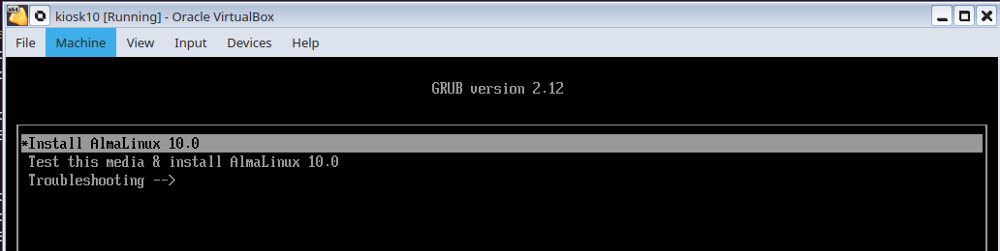

---
hide:
  - navigation
---
# Building a KioskMaker image

!!! note "Note"
	 If you would like a kiosk image built for you, the [author](mailto:jeff@redradishtech.com) is available for consulting. KioskMaker originated as a consulting project.


Here we describe how to build your own kiosk disk image.

## Requirements

You will need:

 - A Linux environment (I use Ubuntu 25.04, but any will do)
 - Virtualbox (tested with 7.1.12)
 - A clean AlmaLinux iso image (tested with AlmaLinux 10).
 - A lot of patience as you follow the docs, and run the indicated scripts, and repeatedly rebuild and tweak your kiosk in Virtualbox.

## Install VirtualBox

VirtualBox is quite fiddly to install, at least on Ubuntu. I install VirtualBox by:

 - downloading the [latest Virtualbox .deb](https://www.virtualbox.org/wiki/Linux_Downloads)
 - `dpkg -i` the .deb 
 - `apt install --fix-broken` to get missing dependencies
 - Adding myself to `vboxusers`:
 ```
 groupadd vboxusers
 sudo usermod -aG vboxusers $USER
 newgrp vboxusers
 ```
 - Launch virtualbox from my `vboxusers`-enabled shell:
 ```
 virtualbox
 ```
Nothing else virtualization-related can be running. E.g. uing a Ryzen CPU, I got this error:
```
VBoxManage: error: VirtualBox can't enable the AMD-V extension. Please disable the KVM kernel extension, recompile your kernel and reboot (VERR_SVM_IN_USE) VBoxManage: error: Details: code NS_ERROR_FAILURE (0x80004005), component ConsoleWrap, interface IConsole
```
This is fixable by running `sudo rmmod kvm kvm_amd`.

 If you get weird errors, try deleting `~/.VirtualBox/` to clean out old settings from past installations.

## Deploy AlmaLinux to a Virtualbox VM

The process of setting up a VirtualBox VM and installing AlmaLinux is fully automated by the `01_createkiosk_virtualbox` script: 

```bash title="01_createkiosk_virtualbox"
--8<-- "01_createkiosk_virtualbox"
```
You should not need to edit `01_createkiosk_virtualbox`, but you probably will need to edit the Kickstart config file, specifically the `keyboard`, `lang` and `timezone` sections:
```bash title="ks.cfg"
--8<-- "ks.cfg"
```
Edit `ks.cfg` and run `./01_createkiosk_virtualbox`.  If all goes well, a fresh VM will be created, and boot pointing to the AlmaLinux iso. 




After kicking off the installation, no further interaction should be required from you. The installation should automatically start:


Once the installer completes you can reboot, and the VM should boot into a terminal prompt. You now have a clean AlmaLinux ready to be turned into a kiosk.

## Kioskify the OS

We now need to turn our vanilla AlmaLinux install into a kiosk. This is done with the `02_kioskify-vm` script:

```bash title="02_kioskify-vm"
--8<-- "02_kioskify-vm"
```

Before running `02_kioskify-vm`, edit it and change `KIOSKMODE_GRUB_PASSWORD` to a unique password. This password will be needed later if you want to convert a locked-down kiosk back to 'configuration mode'.

When running `./02_kioskify-vm` there will be a lot of text output, which *must* end with the `VM has been kioskified` line. If not, the script failed part-way and you will have to examine it and debug.

!!! note "If kioskify fails..."

	 The `02_kioskify-vm` script copies `./copied-to-kiosk/opt/kiosk` to `/opt/kiosk` on the VM, and then invokes `/opt/kiosk/kioskify` inside the VM. If anything breaks, you can edit `./copied-to-kiosk/opt/kiosk/kioskify` locally, then re-run `./02_kioskify-vm` to deploy and re-run it. `/opt/kiosk/kioskify` is idempotent and can be run as many times as necessary. See [opt/kiosk-contents](opt-kiosk-contents.md)

Reboot the now-kioskified VM (e.g. `ssh kiosk reboot`). It should boot with 3 Grub boot options:


Choose the 'read-write' option.


Your Virtualbox VM is now in the KioskMaker configuration state, ready to be packaged. You might like to save an image of the VM.

Now shut down the kiosk VM _very carefully_ by running `ssh kiosk shutdown now`, _not_ by simply powering down the VM. Powering down the VM would leave the disk filesystem in a dirty state.

# Recreating the raw disk image

We can now generate a 'raw' image of the kiosk.

Proceed as above with `01_createkiosk_virtualbox` and `02_kioskify-vm`.  Then run `03_create_disk_image`:

```bash title="Output"
jturner@jturner-desktop:~/kioskmaker$ ./03_create_disk_image --wipe
+ rm -f '/home/jturner/VirtualBox VMs/kiosk10/kiosk10.img'
+ vboxmanage internalcommands converttoraw '/home/jturner/VirtualBox VMs/kiosk10/kiosk10.vdi' '/home/jturner/VirtualBox VMs/kiosk10/kiosk10.img'
Warning: program compiled against libxml 212 using older 209
Converting image "/home/jturner/VirtualBox VMs/kiosk10/kiosk10.vdi" with size 8589934592 bytes (8192MB) to raw...
+ echo 'kiosk.img generated. Contents (fdisk -l):'
kiosk.img generated. Contents (fdisk -l):
+ fdisk -l '/home/jturner/VirtualBox VMs/kiosk10/kiosk10.img'
Disk /home/jturner/VirtualBox VMs/kiosk10/kiosk10.img: 8 GiB, 8589934592 bytes, 16777216 sectors
Units: sectors of 1 * 512 = 512 bytes
Sector size (logical/physical): 512 bytes / 512 bytes
I/O size (minimum/optimal): 512 bytes / 512 bytes
Disklabel type: gpt
Disk identifier: 6C8DCAED-4D3A-45A4-A23B-40F7CD002E03

Device                                              Start      End  Sectors  Size Type
/home/jturner/VirtualBox VMs/kiosk10/kiosk10.img1    2048  1230847  1228800  600M EFI System
/home/jturner/VirtualBox VMs/kiosk10/kiosk10.img2 1230848  3327999  2097152    1G Linux filesystem
/home/jturner/VirtualBox VMs/kiosk10/kiosk10.img3 3328000 16775167 13447168  6.4G Linux LVM
```

```bash title="03_createraw"
--8<-- "03_create_disk_image"
```

You now have an image that can be `dd`'ed straight to the disk of a kiosk. See `./04_burn_physical_disk` for how to do that:

```bash title="04_burn_physical_disk"
--8<-- "04_burn_physical_disk"
```

In my case, the kiosks run on SATA SSDs which are hot-pluggable (at least on my computer). This allowed fairly rapid burning of multiple SSDs - just editing `$dev` in the above script.  The SSDs were later installed into kiosks.


# Addendum: Choice of base OS

KioskMaker is currently built on AlmaLinux. These were the criteria considered:

## Windows?

[Windows has a Kiosk mode](https://learn.microsoft.com/en-us/windows/configuration/kiosk/), and it is apparently possible to make Windows 10+ read-only with the [Unified Write Filter](https://learn.microsoft.com/en-us/windows/configuration/unified-write-filter/). I did not explore this, on the assumption that telemetry, Cortana, and other junk would be too hard to remove, and Window LTSC edition too hard to (legally) obtain.

## Driver availability and Secure Boot friendliness

If your kiosk runs on specialized hardware, you'll need to check driver availability.

My target kiosk hardware is a [SEL-3350](https://selinc.com/products/3350/) fanless computer designed for running in substations and other industrial settings. SEL provides drivers for Red Hat (RHEL) and Debian-derived operating systems. This eliminates a few possibilities like Porteus (Slackware-based), NixOS and Alpine.

RHEL or Debian?  Again, drivers may be a factor. Ideally you want drivers signed for your kernel version. DKMS drivers require turning off Secure Boot in the BIOS, or enrolling the DKMS signing key in the BIOS of every deployed kiosk. Neither option is appealing.

## Kiosk mode support

By 'kiosk', we mean a computer that automatically starts one app, without login, with minimal UI distractions, locked down to prevent accidental or malicious changes. There are some common options:

### 1) `gnome-kiosk`
In RHEL/Gnome, the minimal one-app kiosk environment is supported directly by the `gnome-kiosk` and `gnome-kiosk-script-session` packages, and documented [by redhat](https://docs.redhat.com/en/documentation/red_hat_enterprise_linux/9/html/customizing_the_gnome_desktop_environment/assembly_restricting-the-session-to-a-single-application_customizing-the-gnome-desktop-environment#assembly_restricting-the-session-to-a-single-application_customizing-the-gnome-desktop-environment). `gnome-kiosk` is not available in Debian/Ubuntu. This is the solution KioskMaker uses.
### 2) Ubuntu Core
 The _canonical_ way to make a kiosk out of Ubuntu is to [build on Ubuntu Core](https://mir-server.io/docs/make-a-secure-ubuntu-web-kiosk), with the `wpe-webkit-mir-kiosk` snap. Ubuntu Core is snap-based, completely containerized and optimized for security. However, in practice:
 - The focus on containerization and security makes development complicated, cumbersome and slow. Any changes must be packaged as 'gadget snaps', defined in a model, and the OS rebuilt. OS hangs are almost impossible to debug.
 - `wpe-webkit-mir-kiosk` is, as the name suggests, Webkit-based, whereas we want Chrome for maximum compatibility. Apparently Chrome is too difficult to containerize, so there is no `wpe-chrome-mir-kiosk`.
 - The documentation is incomplete and the project seems half-abandoned. Possibly because Mir (the technical base) is a technological dead end, a Wayland alternative part of the now-abandoned Unity desktop environment, later repurposed for 'IoT'.
### 3) Customized window manager
To get a minimal kiosk-like effect, we could also have used Gnome Shell with extensions ([1](https://extensions.gnome.org/extension/4099/no-overview/), [2](https://extensions.gnome.org/extension/545/hide-top-bar/)) and tweaks hiding as much UI as possible.  The problem with this approach is that we _also_ want Gnome Shell used in 'configuration mode' to not be locked down. We would need two distinct copies of `/home/kiosk` for ro and rw modes. It is simpler to have the `kiosk` user's Gnome Shell environment used only for rw mode, and `gnome-kiosk` used for ro mode.

Besides Gnome Shell, there are any number of naturally minimalist stripped-down window managers that would work, or simply `.xinitrc` launching a browser. `gnome-kiosk` is just simpler, and handles restarts of the app correctly.

## Read-only support

When in kiosk mode, the disk must be read-only, with any apparent writing (e.g. browser caches) going to RAM. Power-cycling the kiosk must restore it to its original condition.

Redhat-derived distributions natively support this through the `readonly-root` package. The [documentation](https://access.redhat.com/documentation/en-us/red_hat_enterprise_linux/9/html-single/managing_file_systems/index#setting-read-only-permissions-for-the-root-file-system_managing-file-systems) describes how to mark particular directories, like `/home/kiosk` as in-RAM overlays of the underlying disk.

Debian-derived distributions also support this via the `overlayroot` package. There is little documentation, but it worked as expected.

### Full or minimal?

Initially I started with the AlmaLinux 'minimal' iso, and added just enough packages required to get Gnome running. However, 'just enough' is hard to determine, and configuration is flaky. For instance, with  my hand-picked packages:
 - Gnome settings app hangs when I try to set the timezone automatically.
 -  There's a strange white block between hour and date:
   
 - if 'nautilus' isn't present, one cannot pick a background image file.

The disk size difference is 4.1Gb (minimal + packages) vs. 4.9Gb (desktop), so in the end I switched to desktop.


## Summary

AlmaLinux ticks all the required boxes:

 - Secure boot friendly drivers available
 - Well-documented kiosk mode
 - Well-documented read-only mode