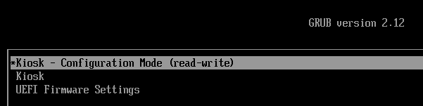

---
hide:
  - navigation
---

# You're in Kiosk mode!

If you are reading this on a kiosk, it has been locked down to run only this browser.

### ...locked down too soon?

This is a placeholder web page. The kiosk will normally point to something more interesting!

To change from locked-down kiosk mode back to [configuration mode](config.md)

 - Power cycle the kiosk
 - As the kiosk starts, press Esc.
 - You should see the grub boot screen:

   
   
   Choose 'Kiosk - Configuration Mode (read-write)'

- When prompted for username, enter `root`
- When prompted for a password, enter the password set at kiosk build time.

